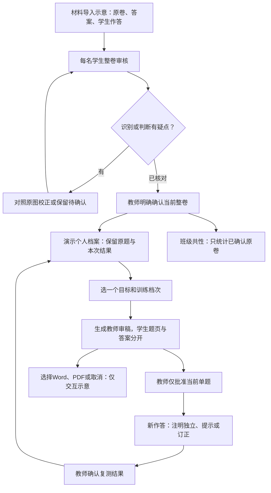

# 老师工作台原型：页面与动作流程

本图对应 prototype/index.html 的一次性交互样稿。界面操作使用虚构数据，仅保存在本页内存；图中归档与审批均为演示，不代表正式产品已经实现。

```mermaid
flowchart TD
    A[材料导入示意：原卷、答案、学生作答] --> B[每名学生整卷审核]
    B --> C{识别或判断有疑点？}
    C -->|有| D[对照原图校正或保留待确认]
    D --> B
    C -->|已核对| E[教师明确确认当前整卷]
    E --> F[演示个人档案：保留原题与本次结果]
    E --> G[班级共性：只统计已确认原卷]
    F --> H[选一个目标和训练档次]
    H --> I[生成教师审稿，学生题页与答案分开]
    I --> J[教师仅批准当前单题]
    J --> K[新作答：注明独立、提示或订正]
    K --> L[教师确认复测结果]
    L --> F
    I --> M[选择Word、PDF或取消：仅交互示意]
```

评审重点：整卷审核是否顺手、原图与识别是否容易对照、确认范围是否清晰、档案与班级统计是否分开、补练难度与复测更新是否可理解。正式存储、真实识图、模型接入和文档导出另阶段实现。
